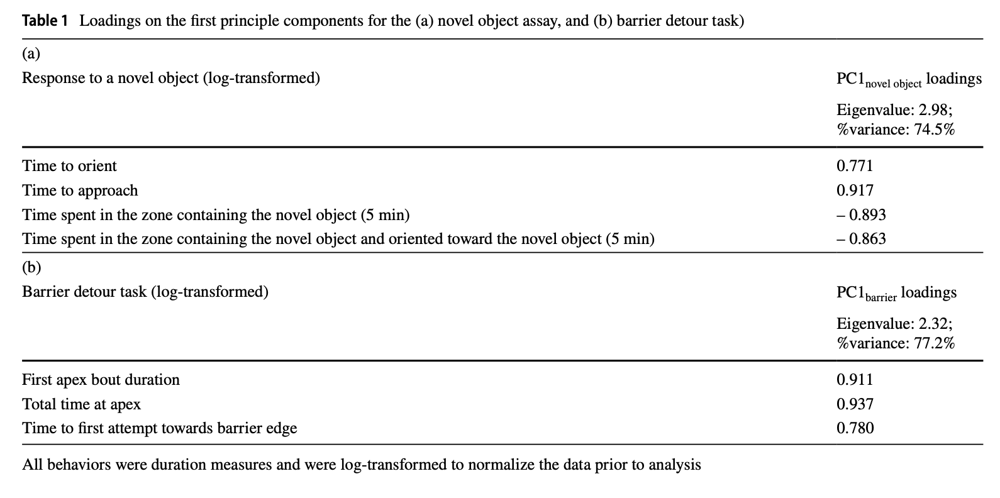
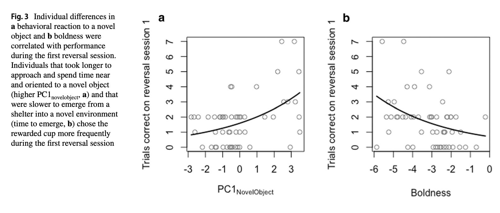
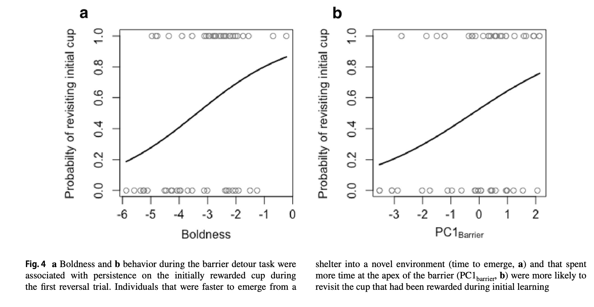
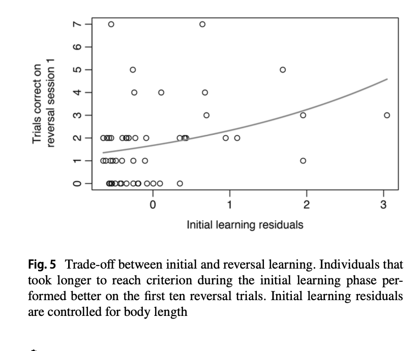

Here I am attempting to replicate the data analysis in Bensky and Bell 2020, "Predictors of individual variation in reversal learning performance in three‐spined sticklebacks". This paper looked at the cognitive flexibility, i.e. ability to reverse learning, in  stickleback fish. They performed three behavior assays:
-Boldness, measured by latency to emerge from a shelter
-Response to a novel object
-Barrier detour task
Then they performed a learning task, asking the fish to learn to choose one color over the other (by association with food reward). Once the fish had learned, they changed the color associated with the food reward. This is how they tested for reversal learning. 

The parts of the paper I will be trying to replicate are:

1- PCAs on Response to a novel object and Barrier detour task variables, to reduce number of variables for further analyses
2- Pearson correlations to look at relationships between the three behaviors mentioned above
3- Generalized linear model to look at relationship between the three behaviors and initial learning performance 
4- Generalized linear model to look at relationship between two of the three behaviors and reversal learning performance (Figure 3)
5- Generalized linear model to look at relationship between two of the three behaviors and number of wrong attempts made during reversal learning trial (Figure 4)
6- Generalized linear model to look at relationship between initial and reversal learning performance (Figure 5)

In the final part of this document, I perform visualization using ggplot2 for parts 4,5,and 6.

The data set was included in the supplemental material and contains all behavior, learning and reversal learning data for n=53 individuals. 

Loading in necessary packages and data:

```{r}
knitr::opts_chunk$set(fig.path = "images/")
suppressPackageStartupMessages({
  library(tidyverse)
library(factoextra)
library(MASS)
})
d = read_csv("bensky_and_bell_2020.csv") 
head(d)
```

1- PCAs on Response to a novel object and Barrier detour task variables, to reduce number of variables for further analyses

These results are presented in Table 1 of the paper.

I performed a PCA on 4 novel object task variables that were already log transformed in the downloaded dataset. All of these measure exploration of a novel object in different ways:

Novel_LN_TimeToOrient: time to orient to the object
Novel_LN_Approach: time to approach the object
Novel_LN_Near5: time near object in first 5 minutes
Novel_LN_NearandOriented: time near object and oriented towards object in first 5 minutes

Once I got the PC1 loadings, I added them to the main dataframe d.

```{r}
novel_vars = c("Novel_LN_TimeToOrient", "Novel_LN_Approach",
                      "Novel_LN_Near5", "Novel_LN_NearandOriented")
d_novel = d %>% 
  dplyr::select(all_of(novel_vars) )
novel_pca = prcomp(d_novel, scale = TRUE)

#now to get the loadings I thought I could use view(novel_pca), but this gave me different results than the paper
#they mention the factoextra package in text, so i used this package's PCA summary function, get_pca()
novel_pca_factoextra = get_pca(novel_pca)
novel_pca_loadings = novel_pca_factoextra$coord
#the Dim1 column here matches the PCA loadings reported in the paper Table 1

#lastly, to get the scores of PC1 for further analysis:
novel_pca_scores = as.data.frame(novel_pca$x)
novel_PC1_scores = novel_pca_scores$PC1

#adding the scores to d
d = d %>% mutate(novel_PC1_scores = novel_PC1_scores)
```

Then I performed another PCA, this time with variables measured in the barrier detour task. 

For the barrier detour task, the fish was allowed to access food unimpeded three times, and then on the fourth trial, a transparent barrier was placed in front which the fish had to go around. The more time spent near the transparent barrier, in the region closest to the food (called the "barrier apex"), the more persistent an individual was said to be.

The three variables were:
Barrier_LN_FirstBout - time spent at barrier apex the first time the fish reaches it
Barrier_LN_Apex- overall time spent at barrier apex
Barrier_LN_EtoB- "Emerge to Backside"- time it takes for the fish to go around and behind the barrier 

Once I got the PC1 loadings, I added them to the main dataframe d.

```{r}
#running barrier task pca, same steps as above

barrier_vars = c("Barrier_LN_FirstBout", "Barrier_LN_Apex", "Barrier_LN_EtoB")
d_barrier = d %>% 
  dplyr::select(all_of(barrier_vars))
barrier_pca = prcomp(d_barrier, scale = TRUE)

#getting loadings
barrier_pca_factoextra = get_pca(barrier_pca)
barrier_pca_loadings = barrier_pca_factoextra$coord
#the Dim1 column here matches the PCA loadings reported in the paper Table 1

#to get the scores of PC1 for further analysis:
barrier_pca_scores = as.data.frame(barrier_pca$x)
barrier_PC1_scores = barrier_pca_scores$PC1

#adding the scores to d
d = d %>% mutate(barrier_PC1_scores = barrier_PC1_scores)
```

The results of these PCAs matched the paper. Here I put my data in a table form so it is easy to compare with the values in table 1 of the paper that I have inserted below.

```{r}
novel_table1 = as.data.frame(novel_vars) %>% 
  mutate(novel_PC1_loadings = as.data.frame(novel_pca_loadings)$Dim.1) %>% 
  rbind(c("eigenvalue", (summary(novel_pca)$importance[1, "PC1"])^2)) %>% 
  rbind(c("percent_variance", summary(novel_pca)$importance[2, "PC1"]))

barrier_table1 = as.data.frame(barrier_vars) %>% 
  mutate(barrier_PC1_loadings = as.data.frame(barrier_pca_loadings)$Dim.1) %>% 
  rbind(c("eigenvalue", (summary(barrier_pca)$importance[1, "PC1"])^2)) %>% 
  rbind(c("percent_variance", summary(barrier_pca)$importance[2, "PC1"]))

knitr::kable(novel_table1)
knitr::kable(barrier_table1)



```


Now, I move on to things discussed in the results section

2- Pearson correlations to look at relationships between the three behaviors 

In the final part of this document, I perform visualization using ggplot2 for parts 4,5,and 6.

The data set was included in the supplemental material and contains all behavior, learning and reversal learning data for n=53 individuals. 


First, they computed pairwise Pearson correlation coefficients to test the relationships between all three behaviors:
-Boldness, measured by latency to emerge from a shelter (LN_Emerge_Average)
-Response to a novel object, measured by PC1 of novel object task above (novel_PC1_scores)
-Barrier detour task, measured by PC1 of barrier detour task above (barrier_PC1_scores)

```{r}
cor_boldness_novel = cor.test(d$LN_Emerge_Average*(-1), d$novel_PC1_scores, method = "pearson")

cor_boldness_barrier = cor.test(d$LN_Emerge_Average*(-1), d$barrier_PC1_scores, method = "pearson")

cor_novel_barrier = cor.test(d$novel_PC1_scores, d$barrier_PC1_scores, method = "pearson")

#I compare my results ("replicated" variables) to that of the paper's in this table:

cor_test = c("cor_boldness_novel", "cor_boldness_barrier", "cor_novel_barrier")
r_paper = c(-0.357, 0.374, -0.263)
r_replicated = c(cor_boldness_novel$estimate, cor_boldness_barrier$estimate, cor_novel_barrier$estimate)
p_value_paper = c(0.0087, 0.0058, 0.057)
p_value_replicated = c(cor_boldness_novel$p.value, cor_boldness_barrier$p.value, cor_novel_barrier$p.value)
cor_test_summary = as.data.frame(cor_test) %>% 
  mutate(r_paper = r_paper,
         r_replicated = r_replicated,
         p_value_paper = p_value_paper,
         p_value_replicated = p_value_replicated)
knitr::kable(cor_test_summary)

```

3- Generalized linear model to look at relationship between the three behaviors and initial learning performance 

They used generalized linear models to look at whether learning (initial and reversal) were predicted by the three behaviors.

Initial learning was related to all three behaviors. I used glm.nb() function for these. For only these three models, they used length of the fish as a covariate. 

```{r}
#behaviors were related to initial learning performance
#for these, standard length was included as a covariate
initial_w_boldness = glm.nb(Initial_Sessions ~ LN_Emerge_Average+Length, data=d)

initial_w_novel = glm.nb(Initial_Sessions ~ novel_PC1_scores+Length, data=d)

initial_w_barrier = glm.nb(Initial_Sessions ~ barrier_PC1_scores+Length, data=d)

#making a table comparing results with paper:

inital_w_behaviors = c("boldness", "novel object", "barrier task")
iwb_beta1_paper = c(0.159, 0.162, 0.196)
iwb_beta1_replicated = c(initial_w_boldness[["coefficients"]][["LN_Emerge_Average"]],
                     initial_w_novel[["coefficients"]][["novel_PC1_scores"]],
                     initial_w_barrier[["coefficients"]][["barrier_PC1_scores"]])
iwb_z_paper = c(-2.343, 3.37, -3.732)
iwb_z_replicated = c(coef(summary(initial_w_boldness))[, "z value"][["LN_Emerge_Average"]],
                 coef(summary(initial_w_novel))[, "z value"][["novel_PC1_scores"]],
                 coef(summary(initial_w_barrier))[, "z value"][["barrier_PC1_scores"]])
iwb_p_value_paper = c(0.0191, 0.0007, 0.0002)
iwb_p_value_replicated = c(coef(summary(initial_w_boldness))[, "Pr(>|z|)"][["LN_Emerge_Average"]],
                           coef(summary(initial_w_novel))[, "Pr(>|z|)"][["novel_PC1_scores"]],
                           coef(summary(initial_w_barrier))[, "Pr(>|z|)"][["barrier_PC1_scores"]])
initial_w_behaviors_summary = as.data.frame(inital_w_behaviors) %>% 
  mutate(iwb_beta1_paper = iwb_beta1_paper,
         iwb_beta1_replicated = iwb_beta1_replicated,
         iwb_z_paper = iwb_z_paper,
         iwb_z_replicated= iwb_z_replicated,
         iwb_p_value_paper = iwb_p_value_paper,
         iwb_p_value_replicated = iwb_p_value_replicated)
knitr::kable(initial_w_behaviors_summary)
```

4- Generalized linear model to look at relationship between two of the three behaviors and reversal learning performance (Figure 3)

Next, reversal learning was only related to two of the three behaviors - boldness and novel object task. Again I used the glm.nb() function, with no covariate. These models were visualized in Fig 3.

```{r}
#two behaviors were related to reversal learning performance

reversal_w_boldness = glm.nb(Reversal_Session1 ~ LN_Emerge_Average, data=d)

reversal_w_novel = glm.nb(Reversal_Session1 ~ novel_PC1_scores, data=d)

#making a table comparing results with paper:

reversal_w_behaviors = c("boldness", "novel object")
rwb_beta1_paper = c(-0.268, 0.234)
rwb_beta1_replicated = c(reversal_w_boldness[["coefficients"]][["LN_Emerge_Average"]],
                         reversal_w_novel[["coefficients"]][["novel_PC1_scores"]])
rwb_z_paper = c(-2.852, 3.714)
rwb_z_replicated = c(coef(summary(reversal_w_boldness))[, "z value"][["LN_Emerge_Average"]],
                     coef(summary(reversal_w_novel))[, "z value"][["novel_PC1_scores"]])
rwb_p_value_paper = c(0.0044, 0.0002)
rwb_p_value_replicated = c(coef(summary(reversal_w_boldness))[, "Pr(>|z|)"][["LN_Emerge_Average"]],
                           coef(summary(reversal_w_novel))[, "Pr(>|z|)"][["novel_PC1_scores"]])
reversal_w_behaviors_summary = as.data.frame(reversal_w_behaviors) %>% 
  mutate(rwb_beta1_paper = rwb_beta1_paper,
         rwb_beta1_replicated = rwb_beta1_replicated,
         rwb_z_paper = rwb_z_paper,
         rwb_z_replicated= rwb_z_replicated,
         rwb_p_value_paper = rwb_p_value_paper,
         rwb_p_value_replicated = rwb_p_value_replicated)
knitr::kable(reversal_w_behaviors_summary)
```

```{r}
#The above models for reversal learning ~ behaviors were visualized in Figure 3

#Figure 3a
p1 = predict(reversal_w_novel,type = "response", se.fit = TRUE)
ggplot(d) +
  geom_point(aes(x = novel_PC1_scores, y = Reversal_Session1))+
  geom_line(aes(x = novel_PC1_scores, y = p1$fit))+
  theme_classic()

#Figure 3b
p2 = predict(reversal_w_boldness,type = "response", se.fit = TRUE)
ggplot(d) +
  geom_point(aes(x = -LN_Emerge_Average, y = Reversal_Session1))+
  geom_line(aes(x = -LN_Emerge_Average, y = p2$fit))+
  theme_classic()

#These look similar to graphs from the paper:



```

5- Generalized linear model to look at relationship between two of the three behaviors and number of wrong attempts made during reversal learning trial (Figure 4)

Next, persistence as measured by approaches made to the wrong color in the reversal learning trial were measured.  They converted the measure in the variable "wrong visits before correct" to a binary variable "FirstReversal_PersistBeforeCorrect", where 0 = one visit to wrong color, and 1 = more than one visit to wrong color. I call these variables wrong_w_behavior (as in wrong color approached)

Since this is binary data, I used a binomial glm (glm() function with family = "binomial") to measure how persistence is related to two of the three behaviors, boldness and barrier task. 

These models were visualized in Fig 4.


```{r}

wrong_w_boldness = glm(FirstReversal_PersistBeforeCorrect~ LN_Emerge_Average, family = "binomial",data=d)

wrong_w_barrier = glm(FirstReversal_PersistBeforeCorrect~ barrier_PC1_scores, family = "binomial",data=d)

#making a table comparing results with paper:

wrong_w_behaviors = c("boldness", "barrier object")
wwb_beta1_paper = c(0.5882, 0.4849)
wwb_beta1_replicated = c(wrong_w_boldness[["coefficients"]][["LN_Emerge_Average"]],
                         wrong_w_barrier[["coefficients"]][["barrier_PC1_scores"]])
wwb_z_paper = c(2.417, 2.265)
wwb_z_replicated = c(coef(summary(wrong_w_boldness))[, "z value"][["LN_Emerge_Average"]],
                     coef(summary(wrong_w_barrier))[, "z value"][["barrier_PC1_scores"]])
wwb_p_value_paper = c(0.0157, 0.0235)
wwb_p_value_replicated = c(coef(summary(wrong_w_boldness))[, "Pr(>|z|)"][["LN_Emerge_Average"]],
                           coef(summary(wrong_w_barrier))[, "Pr(>|z|)"][["barrier_PC1_scores"]])
wrong_w_behaviors_summary = as.data.frame(wrong_w_behaviors) %>% 
  mutate(wwb_beta1_paper = wwb_beta1_paper,
         wwb_beta1_replicated = wwb_beta1_replicated,
         wwb_z_paper = wwb_z_paper,
         wwb_z_replicated= wwb_z_replicated,
         wwb_p_value_paper = wwb_p_value_paper,
         wwb_p_value_replicated = wwb_p_value_replicated)
knitr::kable(wrong_w_behaviors_summary)

```

```{r}

#The above two models for wrong approaches ~ behaviors were visualized in Fig 4

p3 = predict(wrong_w_boldness,type = "response", se.fit = TRUE)
ggplot(d) +
  geom_point(aes(x = -LN_Emerge_Average, y = FirstReversal_PersistBeforeCorrect))+
  geom_line(aes(x = -LN_Emerge_Average, y = p3$fit))+
  theme_classic()

p4 = predict(wrong_w_barrier,type = "response", se.fit = TRUE)
ggplot(d) +
  geom_point(aes(x = -barrier_PC1_scores, y = FirstReversal_PersistBeforeCorrect))+
  geom_line(aes(x = -barrier_PC1_scores, y = p4$fit))+
  theme_classic()


```

6- Generalized linear model to look at relationship between initial and reversal learning performance (Figure 5)

Finally, they asked whether fish initial learning is related to flexibility, i.e. reversal learning. Since they wanted to include Length as a covariate for initial learning, I first did a negative binomial glm for initial learning with length, took the residuals from that as the new initial learning variable, and ran a glm of reversal learning with this new variable. 

Initial learning was not related to reversal learning overall (variable "Reversal_Sessions), but it was related to the first step of reversal learning (variable "Reversal_Session1). The latter is visualized in Fig 5. 

```{r}
#first, we need the residuals of initial learning controlled for Length
initial_w_length = glm.nb(Initial_Sessions ~ Length, data=d)
#adding the residuals to our dataset:
d = d %>% 
  mutate(initial_residuals = initial_w_length$residuals)

#initial learning was not related to reversal learning
initial_w_reversal = glm.nb(Reversal_Sessions ~ initial_residuals, data=d)

#initial learning was correlated to first step of reversal learning
initial_w_reversal1 = glm.nb(Reversal_Session1 ~ initial_residuals, data=d)

#making a table comparing results with paper:

initial_w_reversals = c("reversal", "reversal session 1")
iwr_beta1_paper = c(-0.0217, 0.3308)
iwr_beta1_replicated = c(initial_w_reversal[["coefficients"]][["initial_residuals"]],
                         initial_w_reversal1[["coefficients"]][["initial_residuals"]])
iwr_z_paper = c(-0.304, 2.324)
iwr_z_replicated = c(coef(summary(initial_w_reversal))[, "z value"][["initial_residuals"]],
                     coef(summary(initial_w_reversal1))[, "z value"][["initial_residuals"]])
iwr_p_value_paper = c(0.761, 0.0201)
iwr_p_value_replicated = c(coef(summary(initial_w_reversal))[, "Pr(>|z|)"][["initial_residuals"]],
                           coef(summary(initial_w_reversal1))[, "Pr(>|z|)"][["initial_residuals"]])
initial_w_reversals_summary = as.data.frame(initial_w_reversals) %>% 
  mutate(iwr_beta1_paper = iwr_beta1_paper,
         iwr_beta1_replicated = iwr_beta1_replicated,
         iwr_z_paper = iwr_z_paper,
         iwr_z_replicated= iwr_z_replicated,
         iwr_p_value_paper = iwr_p_value_paper,
         iwr_p_value_replicated = iwr_p_value_replicated)

knitr::kable(initial_w_reversals_summary)
```

```{r}

#The second model, for initial learning ~ first session of reversal learning, was visualized in Fig 5

p5 = predict(initial_w_reversal1,type = "response", se.fit = TRUE)
ggplot(d) +
  geom_point(aes(x = initial_residuals, y = Reversal_Session1))+
  geom_line(aes(x = initial_residuals, y = p5$fit))+
  theme_classic()



```

Discussion:
I started by doing PCAs to reduce the amount of variables used in the comparisons of behaviors. In the paper they mentioned the package factoextra, but it took me a bit to realize that they used only the pca summary function get_pca() from this package. The loadings I got from this function were different from what I got from summary$loadings (not shown here). I was confused about this. 

Then I did some pearson correlations which were pretty straightforward to replicate. Before this assignment I was unfamiliar with generalized linear models. Due to this, it took me a while to understand how to use the glm() and glm.nb() functions. Once I understood them the analysis was pretty straightforward. My results matched the paper for the most part, except sometimes the paper would have positive outputs and I would get negative values and vice versa. I did not understand why this happened only sometimes. 


Reference:
Bensky MK, Bell AM. Predictors of individual variation in reversal learning performance in three-spined sticklebacks. Anim Cogn. 2020 Sep;23(5):925-938. doi: 10.1007/s10071-020-01399-8. Epub 2020 Jun 8. PMID: 32514661.


